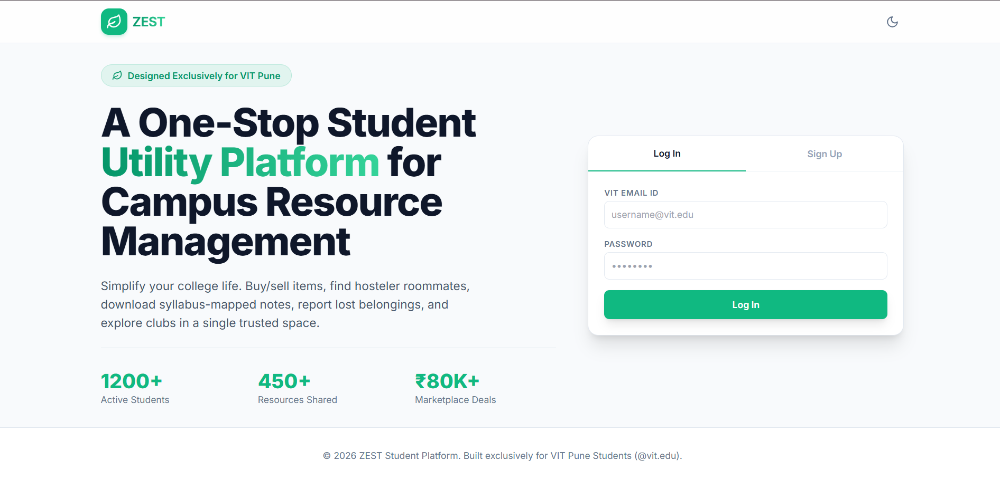
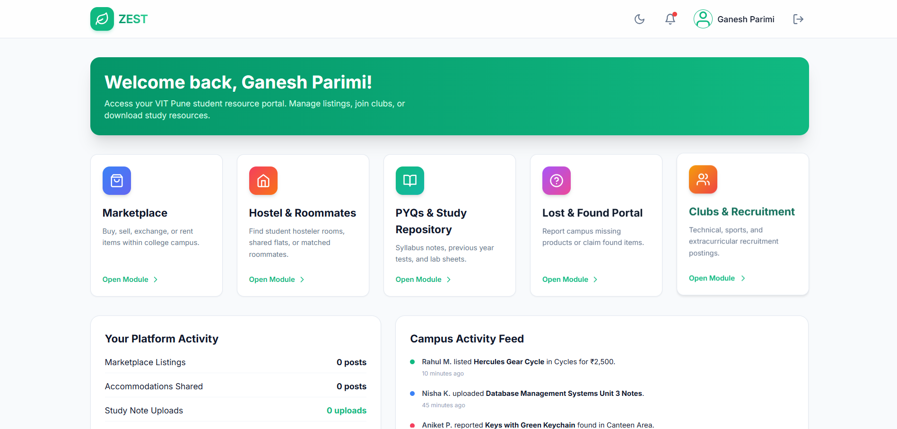
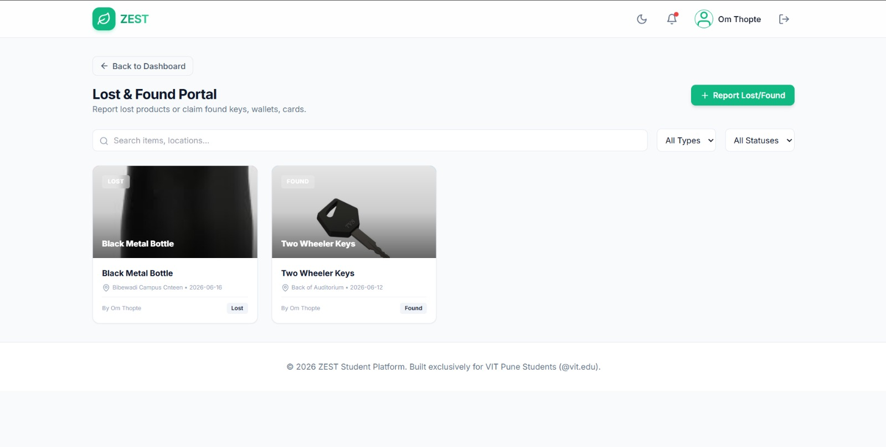
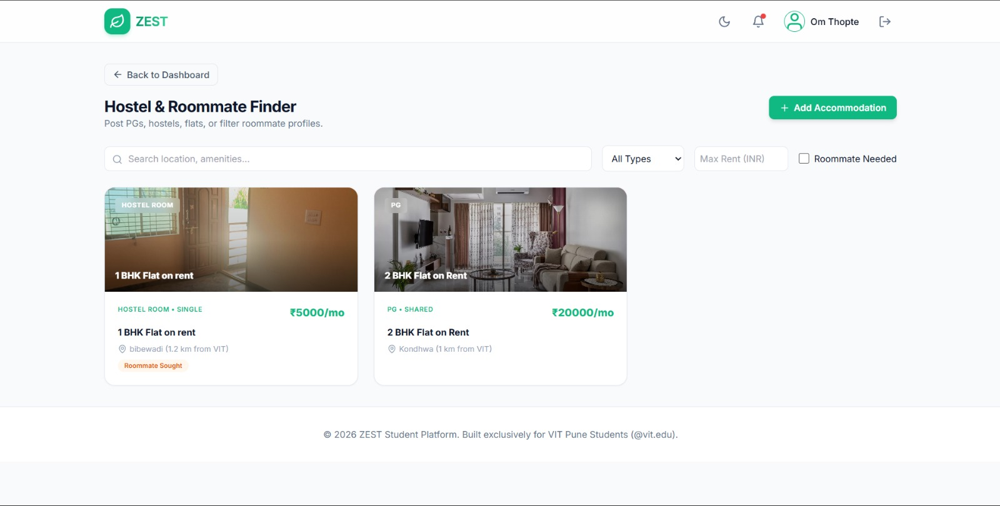

# ZEST — Campus Resource Management Platform

A full-stack web app for college students (VIT Pune, `@vit.edu`) to buy/sell items, find hostels & roommates, share study resources, report lost & found items, and discover clubs. React + Vite frontend, Express backend, with a zero-config local JSON database that upgrades to MongoDB when configured.

---

## Tech Stack

| Layer | Tech |
|---|---|
| Frontend | React 18, Vite 5, Tailwind CSS 3, lucide-react icons |
| Backend | Node.js (ESM), Express 4 |
| Auth | JWT (`jsonwebtoken`) + `bcryptjs` password hashing |
| Database | **File-based JSON** by default → **MongoDB** (`mongoose`) when `MONGO_URI` is set |
| Dev tooling | nodemon, Vite dev server with `/api` proxy |

---
## Screenshots

### Login



### Home



### Lost & Found



### Hostel


## Features

- **Auth** — register/login restricted to `@vit.edu` emails, JWT sessions, profile edit.
- **Marketplace** — list/buy second-hand items, express interest, deal-status tracking.
- **Hostel Finder** — accommodation listings, rent/distance filters, wishlist, roommate profiles.
- **Study Resources** — upload notes, rate & review, downloads counter, contributor leaderboard.
- **Lost & Found** — report lost/found items, claim flow with reporter approval.
- **Clubs** — club recruitment posts with open positions.
- **Edit / Delete** — owners can edit or permanently delete their own posts (all modules, ownership-enforced).
- **Back navigation** — visible back button + browser/mobile back-gesture support (History API).
- **Image upload** — multiple files, drag & drop, and mobile camera capture (stored as base64).
- **Category images** — when no image is uploaded, a category-relevant stock image is shown automatically (deterministic per item), with a gradient fallback if offline.

---

## Project Structure

```
zest/
├── backend/
│   ├── config/db.js          # File-DB / MongoDB abstraction (Mongoose-like API)
│   ├── data/*.json           # Local JSON collections (auto-created)
│   ├── middleware/auth.js     # JWT verification
│   ├── routes/                # auth, marketplace, hostel, resources, lostfound, clubs
│   ├── uploads/               # Static file uploads (served at /uploads)
│   ├── server.js              # Express entry point (port 5000)
│   └── package.json
├── frontend/
│   ├── src/App.jsx            # Single-file React app (all pages/components)
│   ├── vite.config.js         # Dev server on :3000, proxies /api → :5000
│   └── package.json
└── README.md
```

> Note: a stray `package.json` also exists at the repo root (duplicate of the frontend manifest). The real frontend lives in `frontend/` — run all frontend commands from there.

---

## Prerequisites

- **Node.js ≥ 18** (backend uses ESM + top-level `await`)
- **npm** (bundled with Node)
- **MongoDB** — *optional*; only if you want a real DB instead of the local JSON files

---

## Environment Variables (backend)

Only the backend reads env vars. **All have safe fallbacks, so `.env` is optional for local dev.** The frontend needs **no** env file (it uses the Vite `/api` proxy).

| Var | Required? | Default | Purpose |
|---|---|---|---|
| `PORT` | optional | `5000` | API server port |
| `JWT_SECRET` | **yes for production** | `zest_super_secret_key_12345` | Signs JWTs. The hardcoded fallback is insecure — set your own. |
| `MONGO_URI` | optional | *(unset)* | If set → MongoDB; if unset/unreachable → file-based JSON DB. |

Create `backend/.env` (see `backend/.env.example`):

```env
PORT=5000
JWT_SECRET=replace_with_a_long_random_string
# Optional — omit to use the local JSON database:
# MONGO_URI=mongodb://localhost:27017/zest
```

Generate a strong secret:

```bash
node -e "console.log(require('crypto').randomBytes(32).toString('hex'))"
```

---

## Setup & Run (local)

Two terminals — backend and frontend.

**1. Backend** (port 5000)
```bash
cd backend
npm install
npm run dev        # nodemon (auto-restart) | or: npm start
```

**2. Frontend** (port 3000)
```bash
cd frontend
npm install
npm run dev        # → http://localhost:3000
```

Open **http://localhost:3000**, register with an `@vit.edu` email, and start using the app. The frontend proxies all `/api/*` calls to the backend on port 5000.

### Production build (frontend)
```bash
cd frontend
npm run build      # outputs to frontend/dist
npm run preview    # serve the build locally
```

---

## API Reference

Base URL: `/api`. Protected routes require `Authorization: Bearer <token>`.

### Auth
| Method | Path | Auth | Description |
|---|---|---|---|
| POST | `/auth/register` | — | Register (`@vit.edu` only) → returns token |
| POST | `/auth/login` | — | Login → returns token |
| GET | `/auth/me` | ✅ | Current user profile |
| PUT | `/auth/me` | ✅ | Update profile |

### Marketplace
| Method | Path | Auth | Description |
|---|---|---|---|
| GET | `/marketplace` | — | List items (filters: category, search) |
| GET | `/marketplace/:id` | — | Item detail |
| POST | `/marketplace` | ✅ | Create listing |
| PUT | `/marketplace/:id` | ✅ owner | Edit listing |
| DELETE | `/marketplace/:id` | ✅ owner | Delete listing |
| PUT | `/marketplace/:id/status` | ✅ | Update deal status |
| POST | `/marketplace/:id/interest` | ✅ | Express interest |

### Hostels
| Method | Path | Auth | Description |
|---|---|---|---|
| GET | `/hostels` | — | List (filters: type, rent, roommate, search) |
| GET | `/hostels/:id` | — | Detail |
| POST | `/hostels` | ✅ | Create listing |
| PUT | `/hostels/:id` | ✅ owner | Edit listing |
| DELETE | `/hostels/:id` | ✅ owner | Delete listing |
| POST | `/hostels/:id/wishlist` | ✅ | Toggle wishlist |

### Resources
| Method | Path | Auth | Description |
|---|---|---|---|
| GET | `/resources` | — | List (filters: department, semester, subject, search) |
| GET | `/resources/leaderboard` | — | Top contributors |
| GET | `/resources/:id` | — | Detail |
| POST | `/resources` | ✅ | Upload resource |
| PUT | `/resources/:id` | ✅ owner | Edit resource |
| DELETE | `/resources/:id` | ✅ owner | Delete resource |
| POST | `/resources/:id/download` | — | Increment downloads |
| POST | `/resources/:id/review` | ✅ | Add rating & review |

### Lost & Found
| Method | Path | Auth | Description |
|---|---|---|---|
| GET | `/lostfound` | — | List (filters: type, status, search) |
| POST | `/lostfound` | ✅ | Report item |
| PUT | `/lostfound/:id` | ✅ owner | Edit report |
| DELETE | `/lostfound/:id` | ✅ owner | Delete report |
| POST | `/lostfound/:id/claim` | ✅ | Submit a claim |
| PUT | `/lostfound/:id/claim/:claimIndex` | ✅ owner | Approve/reject claim |
| PUT | `/lostfound/:id/status` | ✅ owner | Update status |

### Clubs
| Method | Path | Auth | Description |
|---|---|---|---|
| GET | `/clubs` | — | List posts |
| GET | `/clubs/:id` | — | Detail |
| POST | `/clubs` | ✅ | Create post |
| PUT | `/clubs/:id` | ✅ owner | Edit post |
| DELETE | `/clubs/:id` | ✅ owner | Delete post |

---

## Notes & Gotchas

- **No DB install needed** to start — data persists to `backend/data/*.json`. To reset data, delete those files (recreated empty on next run).
- **MongoDB fallback is graceful**: if `MONGO_URI` is set but unreachable, the server logs a warning and falls back to the file DB after ~2s instead of crashing.
- **Images are base64** in records; the server allows up to 10 MB JSON payloads. Many large images will bloat the JSON files fast — fine for a campus-scale app, move to disk/object storage for production.
- **Multiple images** persist only for hostel listings (`images[]`); marketplace and lost & found use a single `image` field by data model.
- **Category images** are fetched from a free external service (loremflickr) and need internet; offline, the branded gradient placeholder shows.
- **Never commit `backend/.env`** — it's git-ignored. Always override `JWT_SECRET` in production.
- Frontend dev runs on **port 3000** (see `frontend/vite.config.js`), backend on **5000**.
